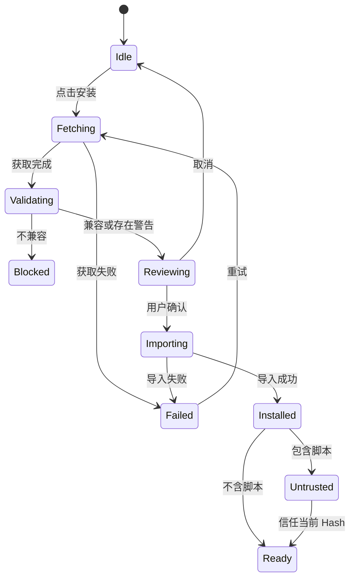
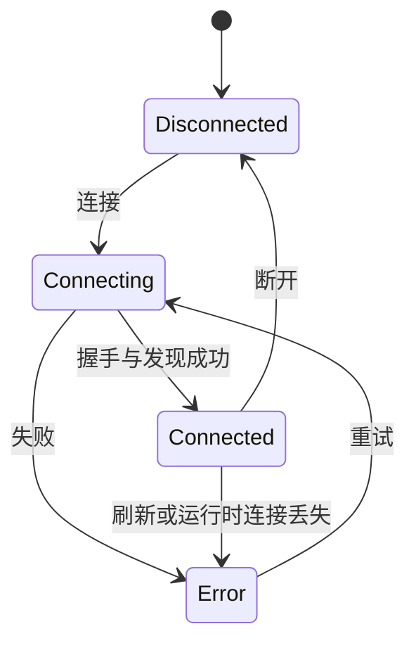

# Maestro 扩展中心（技能与 MCP 连接器）设计与实现方案 v1

> 状态：提案  
> 日期：2026-07-11  
> 范围：Maestro Web / Electron 前端、FastAPI API、SkillHub 适配层、MCP 运行时管理  
> 目标读者：产品、设计、前端、后端、测试与安全评审人员

### 修订说明

本次刷新吸收两轮实现评审结论，重点收敛了：MCP `enabled` 与重启语义、已存 Secret 合并测试、v1 可达状态、两段式 SkillHub 安装/更新、Skill 来源元数据与不可变版本、运行中 Agent 的热更新行为、扩展管理权限、managed 配置、共享设置并发，以及 Shell 重构排期。

## 1. 背景与目标

Maestro 当前已经具备两类扩展能力：

- **Skill**：支持本地 `.md` / `.zip` 技能包的预检、导入、信任、删除和对话调用。
- **MCP**：后端启动时可从 `settings.json` / 环境变量读取服务器配置，连接 MCP Server，并把发现的工具注册进统一工具池。

但两类能力尚未形成面向普通用户的完整管理体验：

- Skill 目前主要通过 Composer 内的小菜单选择，通过弹窗导入，缺少发现、浏览、详情、更新和集中管理页面。
- MCP 目前以启动配置为主，没有面向前端的服务器 CRUD、连接测试、连接状态和工具/资源查看 API。
- 当前 `Layout` 固定为“对话区 + 可选 Context Panel”，无法承载覆盖中部与右侧区域的全宽设置工作台。

本方案建设一个统一的 **扩展中心**：设置按钮是入口，技能与连接器是两个同级管理域。用户进入后保留 Maestro 左侧主导航，右侧全部区域切换为全宽管理界面，不显示对话框与 Context Panel。

### 1.1 产品目标

1. 用户能发现、检查、安装、更新、信任和卸载 Skill。
2. 用户能维护允许范围内的 MCP 配置，测试、连接、断开并检查其工具与资源。
3. Skill 与 MCP 的高风险操作都沿用 Maestro 现有安全策略和审计体系。
4. 对话中的 Skill 快速选择保持轻量，扩展中心负责生命周期管理，两者不混用。
5. Web 与 Electron 使用同一套路由和界面；Electron 下继续使用 Hash Router。

### 1.2 非目标

v1 不实现：

- SkillHub 评分、评论、排行榜、作者主页和付费结算。
- 用户直接向公共 SkillHub 发布技能。
- MCP prompts、sampling 能力。
- MCP OAuth 授权流程。
- 自动授予 MCP 工具免确认权限。
- 远程 MCP 传输。当前代码只有 stdio transport 真正可用；SSE、WebSocket、HTTP 仅为枚举占位。
- 多租户、组织级权限模型。v1 仍以本机单用户 `local-user` 为信任主体。

## 2. 核心产品决策

### 2.1 名称

页面总称为 **扩展中心**，包含：

- 技能
- 连接器

设置菜单使用短标签“技能”“连接器”；页面 Header 使用“扩展中心”帮助用户理解二者关系。

### 2.2 使用独立路由，不使用大弹窗

新增路由：

```text
/settings/skills
/settings/skills/:skillName
/settings/connectors
/settings/connectors/:serverName
```

原因：

- 页面可刷新、可收藏、可前进后退。
- 可在 Web 与 Electron Hash Router 中采用同一写法。
- 生命周期管理属于高信息密度任务，不适合塞进 200px Popover 或常规模态框。
- 后续增加企业扩展策略、更新管理时不需要再次重构入口。

详情统一使用子路由，不再保留“Query 参数或只用本地 Drawer 状态”的二选一：桌面将子路由呈现为 Drawer，窄屏呈现为全屏详情。刷新保留详情，浏览器返回键关闭详情，外部链接可以直接打开指定 Skill 或 Connector。

### 2.3 保留左侧 Sidebar，替换整个右侧工作区

进入扩展中心后：

- 左侧 Sidebar 保持显示，保留品牌、新建对话、任务列表、历史对话和用户入口。
- 中间对话、Composer、TopBar 会话信息和右侧 Context Panel 全部卸载。
- 右侧显示 Extension Header 与全宽内容区。
- 点击历史对话或“新建对话”返回 `/`，并执行相应会话动作。

### 2.4 Skill 生命周期管理与对话选择分离

- 扩展中心：安装、更新、兼容性、信任、卸载。
- Composer `SkillMenu`：从“已安装且可调用”的技能中选择本次对话使用项。

Skill 安装后不自动永久启用到每次对话。只有用户主动在 Composer 选择，或路由器根据 `when_to_use` 匹配时才进入执行链。

### 2.5 v1 MCP 仅开放 stdio

UI 中显示传输方式，但 v1 的创建表单只提供“本地进程（stdio）”。

SSE / Streamable HTTP 入口保持隐藏，不使用“即将推出”占位干扰用户。待后端 transport 完成并通过安全评审后再开放。

## 3. 体验与视觉原则

### 3.1 视觉主张

> 冷静、可信的工业扩展工作台：以排版、状态和分隔建立层级，用最少的浮层完成复杂配置。

### 3.2 内容规划

- 页面 Header：告诉用户当前位置，提供域切换、搜索和主操作。
- 内容导航：推荐 / SkillHub / 已安装，或推荐 / 可用连接器 / 已配置。
- 主列表：快速扫描名称、来源、能力、安全状态和操作。
- 详情抽屉：承载解释、权限、文件、工具、资源和危险操作。
- 安装/连接流程：在抽屉内连续完成，不产生模态框套模态框。

### 3.3 交互主张

1. 路由切换使用 160–200ms 淡入和轻微位移，明确工作模式变化。
2. 技能/连接器 Tab 使用共享下划线位移，保持导航连续性。
3. 安装、测试、连接等异步操作在原位置切换状态，不弹出全局阻塞 Loading。

### 3.4 设计系统约束

- 只使用 `src/index.css` 与 `tailwind.config.ts` 中的语义 Token，不写 raw hex。
- Accent 复用 planning blue，不创建第二套品牌蓝。
- 成功、待确认、失败分别使用 `status-success`、`status-warning`、`status-error`。
- 普通内容采用分隔列表；只有精选项、连接测试报告等自身构成交互单元的内容才使用卡片。
- 阴影只用于 Popover、Drawer 和 Modal，不用于每一条扩展记录。
- 桌面内容最大宽度建议 1440px；列表主体不强制窄栏，保证 1280–1920px 下都可用。

## 4. 总体信息架构

```text
设置
├── 外观
├── 默认引擎
├── 模型
├── 个性化
├── ─────────
├── 技能             → /settings/skills
└── 连接器           → /settings/connectors

扩展中心
├── 技能
│   ├── 推荐
│   ├── SkillHub
│   └── 已安装
└── 连接器
    ├── 推荐
    ├── 可用连接器
    └── 已配置
```

### 4.1 桌面布局

```text
┌───────────────┬──────────────────────────────────────────────────────────┐
│ Maestro       │ 扩展中心                                                 │
│               │ [技能] [连接器]                       搜索   主操作       │
│ 新建对话      ├──────────────────────────────────────────────────────────┤
│ 任务列表      │ 推荐   SkillHub   已安装                                 │
│               │                                                          │
│ 对话历史      │ 精选区（仅推荐页）                                       │
│               │                                                          │
│               │ 筛选 / 分类 / 排序                                       │
│               │ ──────────────────────────────────────────────────────── │
│               │ 扩展列表                                                 │
│               │                                                          │
│ 用户 / 设置   │                                              详情抽屉 →  │
└───────────────┴──────────────────────────────────────────────────────────┘
```

### 4.2 响应式策略

- `>= 1180px`：标准桌面布局，详情使用右侧 460px Drawer。
- `768–1179px`：Sidebar 可折叠；Drawer 宽度为 `min(460px, 52vw)`。
- `< 768px`：扩展中心占满视口；详情作为全屏子页面；v1 不重点优化手机，但不能溢出或不可操作。

## 5. 设置入口设计

在现有 `SidebarSettings` Popover 中增加分隔线与两个入口：

```text
设置
外观                         [浅色/深色]
默认引擎                           >
模型
个性化
──────────────────────────────
技能
连接器
```

点击行为：

- 关闭 Popover。
- 调用 Router `navigate('/settings/skills')` 或 `navigate('/settings/connectors')`。
- 不保留之前打开的模型/个性化 Modal。
- 当前已经位于目标页时只关闭 Popover，不重复导航。

图标建议：

- 技能：`Sparkles` 或 `WandSparkles`。
- 连接器：`PlugZap` 或 `Cable`。

## 6. 技能页面详细设计

### 6.1 Header

左侧：

- 页面标题：扩展中心
- 一级切换：技能 / 连接器

右侧：

- 搜索框：按名称、描述、作者、标签搜索。
- “已安装 N”快捷筛选。
- 主按钮：“导入技能”。

第二行：

- 推荐
- SkillHub
- 已安装

搜索关键字应写入 URL Query：

```text
/settings/skills?tab=hub&q=report&category=manufacturing
```

这样刷新和前进后退不会丢失浏览状态。

### 6.2 推荐页

推荐页由两部分组成：

1. 精选技能：最多四项，横向陈列。
2. 推荐列表：按分类展示常用技能。

精选项展示：

- 图标、名称、单句简介。
- 来源与版本。
- 安装按钮或“已安装”状态。

推荐列表使用紧凑行，不复制参考图的全页面卡片矩阵。

### 6.3 SkillHub 页

筛选项：

- 分类：制造运营、排产调度、数据分析、文档办公、知识查询、开发工具、其他。
- 能力：纯提示词、含附件、含脚本。
- 兼容性：兼容当前 Maestro / 有警告 / 不兼容。
- 来源：官方、企业、社区。
- 排序：推荐、最近更新、名称。

列表行信息：

```text
[图标] 产能日报                                    [安装]
       汇总订单、任务令和齐套数据，生成产能与瓶颈报告
       Maestro 官方 · v1.2.0 · 3 个工具 · 纯提示词 · 兼容
────────────────────────────────────────────────────────────
```

状态按钮：

- 未安装：安装
- 获取中：正在获取技能包（不确定进度）
- 校验中：正在校验
- 待确认：检查权限
- 已安装：已安装
- 有更新：更新
- 不兼容：不可安装
- 失败：重试

### 6.4 已安装页

列表应突出本地状态而非市场信息：

- 名称、版本、作者。
- 安装时间。
- 兼容状态。
- 是否可由用户调用。
- 包含脚本时的信任状态。
- 文件大小与文件数量。
- 更新可用状态（SkillHub 来源才有）。

快捷筛选：

- 全部
- 可用
- 需要处理
- 含脚本
- 有更新

“需要处理”包含：

- `degraded`
- `not_ready`
- 脚本未信任或信任已失效
- SkillHub 版本已撤回（如未来支持）

“有更新”依赖安装时持久化的 Catalog 来源元数据；本地文件导入的技能没有远程来源，不参与自动更新检测。

### 6.5 技能详情 Drawer

Drawer 信息结构：

1. Header
   - 图标、名称、版本、来源。
   - 兼容性 Badge。
   - 安装 / 更新 / 更多操作。
2. 简介
3. 适用场景（`when_to_use`）
4. 能力摘要
   - Prompt
   - Attachments
   - Scripts
5. 工具与权限
   - `allowed_tools`
   - `tool_preconditions`
   - 写工具是否需要确认
6. 文件清单
7. 兼容性报告
8. 包信息
   - SHA-256
   - 文件数量
   - 解压后大小
   - 原始归档大小（ZIP 导入时）
   - 安装时间
9. 危险操作
   - 取消信任
   - 卸载

Drawer 底部保持一个固定操作栏。主要动作最多一个，避免“安装 / 信任 / 启用 / 运行”同时竞争。

### 6.6 安装状态机



关键约束：

- SkillHub 不能直接写 SkillStore。
- v1 的服务端下载使用不确定进度；UI 不承诺百分比和取消能力。若未来需要大包下载，再单独引入异步任务、轮询或 SSE。
- 远程包必须经过与本地上传相同的 `validate_skill_package`。
- 有 warnings 时不阻断，但必须先展示。
- `not_ready` / `disabled` 阻断安装或保持不可调用状态，具体遵从现有 validator 语义。
- 更新视为导入新包；Hash 改变后脚本信任自动失效。
- 安装完成后不自动选择到当前 Composer。

元数据口径统一为：

- `file_count`：`SKILL.md` 与全部附件的文件总数；单 `.md` 技能为 1。
- `bytes`：所有解压后文件的总字节数。
- `archive_bytes`：可选，记录原始 `.zip` / 上传体字节数。

现有实现使用 `file_count=len(attachments)`、`bytes=len(upload_data)`，需要在 Phase 1 修正。旧 SkillStore index 在加载时扫描技能目录重新计算一次并持久化迁移结果。

### 6.7 本地导入

复用现有 `SkillImportModal` 的能力，但建议拆成：

```text
useSkillPackageValidation
useSkillPackageImport
SkillPackageReview
SkillImportDrawer（扩展中心）
SkillImportModal（Composer 快捷入口）
```

扩展中心使用 Drawer；Composer 仍可保留小 Modal。二者共享校验、进度、错误格式化逻辑。

## 7. 连接器页面详细设计

### 7.1 Header 与导航

右侧操作：

- 搜索连接器。
- “已配置 N”快捷筛选。
- 主按钮：“添加连接器”。

Tab：

- 推荐
- 可用连接器
- 已配置

v1 的“推荐”和“可用连接器”由后端静态 `ConnectorCatalogProvider` 提供；“已配置”来自本地 MCP 配置 API。前端不内置第二份 Catalog 数据，避免 Web、Electron 和后端模板版本分叉。

### 7.2 连接器目录模型

连接器目录只保存模板，不保存用户密钥：

```jsonc
{
  "id": "maestro-mes",
  "name": "Maestro MES",
  "description": "查询订单、库存和工单信息",
  "publisher": "Maestro",
  "verified": true,
  "transport_type": "stdio",
  "command_template": "python",
  "args_template": ["/path/to/mes_mcp.py"],
  "env_schema": [
    { "key": "MES_BASE_URL", "secret": false, "required": true },
    { "key": "MES_API_KEY", "secret": true, "required": true }
  ],
  "docs_url": "..."
}
```

选择模板后进入同一个 Connector Editor，只是预填名称、命令、参数和环境变量 Schema。

目录契约：

```python
class ConnectorCatalogProvider(Protocol):
    async def list_connectors(self, query: ConnectorCatalogQuery) -> ConnectorCatalogPage: ...
    async def get_connector(self, connector_id: str) -> CatalogConnector: ...
```

```http
GET /mcp/catalog?q=&category=&cursor=
GET /mcp/catalog/{id}
```

v1 的 `StaticConnectorCatalogProvider` 读取仓库内 JSON/YAML；模板只能预填表单，绝不能自动执行测试或连接。将来接入企业目录时替换 Provider，不改变前端契约。

### 7.3 已配置列表

每行展示：

- 名称、描述、来源。
- 传输类型。
- 连接状态。
- 工具数、资源数。
- 最近测试/连接时间。
- 连接 / 断开 / 重试。

状态定义：

| 状态 | UI | 含义 |
|---|---|---|
| `disconnected` | 灰点 | 已保存但未连接 |
| `connecting` | 旋转状态 | 正在建立正式连接 |
| `connected` | 绿点 | 已连接且完成能力发现 |
| `error` | 红点 | 连接失败，展示可读错误 |

服务器事实状态只有 `disconnected`、`connecting`、`connected`、`error`。当前 stdio 客户端不会产生 `needs_auth`；该后端预留枚举不进入 v1 产品契约。

前端另行维护 `idle`、`testing`、`saving`、`connecting`、`disconnecting`、`refreshing`、`deleting` 等短暂操作态。测试是旁路操作，即使正式服务器处于 `connected`，也可以测试一份尚未保存的编辑草稿，测试过程不改变正式连接状态。

### 7.4 添加/编辑连接器 Drawer

v1 表单字段：

```text
基本信息
  显示名称           必填
  唯一名称           必填；保存后不可直接修改
  描述               可选

连接方式
  本地进程（stdio）   v1 唯一选项

进程配置
  command            必填
  args               字符串数组编辑器
  env                Key/Value 表格
```

环境变量编辑器：

- Key 必须符合环境变量命名规则。
- Value 可标记为 secret。
- secret 保存后只返回 `configured: true`，不返回原值。
- 编辑已保存连接器时，Secret 使用三态：未提交字段表示保持旧值；提交新值表示覆盖；`clear_secret=true` 才表示删除。
- 测试已保存连接器时由服务端合并已存 Secret 与前端覆盖项，前端不需要重新取得或重输未修改的 Secret。

Drawer 操作顺序：

1. 测试连接。
2. 查看测试结果。
3. 保存并连接，或仅保存。

### 7.5 测试连接结果

测试成功：

```text
连接成功                         1.8s
协议版本                         2024-11-05
工具                             8
资源                             3

发现的能力
✓ tools
✓ resources
```

测试失败：

- 简短错误标题。
- 原因分类：命令不存在、进程退出、握手超时、协议错误、工具发现异常。
- 可折叠的原始错误信息。
- “复制诊断信息”。

禁止把 env secret 写入诊断信息和服务端日志。

### 7.6 连接器详情 Drawer

结构：

1. Header：名称、状态、连接/断开按钮。
2. 概览：传输、最近连接、耗时、能力数量。
3. 工具：名称、描述、输入 Schema 摘要、延迟加载状态。
4. 资源：URI、名称、MIME type。
5. 安全说明：所有 MCP 工具调用默认需要人工确认。
6. 配置：脱敏后的 command / args / env keys。
7. 操作：刷新能力、编辑配置、删除。

工具列表不要提供“直接调用”按钮。测试工具调用会引入副作用判断、参数生成和确认链路，超出连接器配置页职责。

### 7.7 连接状态机



正式连接发生变化后，后端必须调用 `Platform.refresh_mcp_tools()`，使共享工具注册表与 SchedulingEngine 白名单同步更新。

`testing`、`saving`、`disconnecting`、`refreshing` 等不属于服务器状态机；它们是可以叠加在事实状态上的前端操作态。例如已连接的服务器可以保持 `Connected`，同时对编辑草稿执行 `testing`。

## 8. 前端架构

### 8.1 Shell 重构

现有 `Layout` 同时承担 App Shell 和 Workspace 双栏布局。建议拆分：

```tsx
<AppShell sidebar={...}>
  <Outlet />
</AppShell>

// /
<WorkspaceLayout
  topBar={...}
  conversation={...}
  panel={...}
/>

// /settings/*
<ExtensionCenterLayout>
  <Outlet />
</ExtensionCenterLayout>
```

推荐文件：

```text
frontend/src/components/layout/AppShell.tsx
frontend/src/components/layout/WorkspaceLayout.tsx
frontend/src/features/extensions/ExtensionCenterLayout.tsx
```

兼容策略：先把现有 `Layout` 内部实现迁移为 `AppShell + WorkspaceLayout`，保持 `Workspace` 行为和测试不变，再接设置路由。

### 8.2 路由结构

```tsx
{
  element: <AppShellRoute />,
  children: [
    { path: '/', element: <Workspace /> },
    { path: '/tasks', element: <Tasks /> },
    {
      path: '/settings',
      element: <ExtensionCenterLayout />,
      children: [
        { index: true, element: <Navigate to="skills" replace /> },
        { path: 'skills', element: <SkillsPage /> },
        { path: 'connectors', element: <ConnectorsPage /> },
      ],
    },
  ],
}
```

注意：当前 `Workspace` 持有会话加载与 Sidebar 回调。为了让 Sidebar 跨路由复用，需要把以下内容上移到 `AppShellRoute` 或新增 Controller：

- `useWorkspaceSessions`
- Sidebar conversation props
- theme/defaultEngine state
- new/select/rename/delete session handlers
- sidebar collapsed state

如果一次重构风险过大，v1 可先用 `ExtensionCenterPage` 自己渲染 Sidebar；但这会重复会话控制逻辑，只建议作为短期过渡，不作为最终结构。

### 8.3 前端目录

```text
frontend/src/features/extensions/
├── ExtensionCenterLayout.tsx
├── ExtensionHeader.tsx
├── ExtensionTabs.tsx
├── ExtensionSearch.tsx
├── ExtensionEmptyState.tsx
├── ExtensionDetailDrawer.tsx
├── skills/
│   ├── SkillsPage.tsx
│   ├── SkillCatalogList.tsx
│   ├── SkillListRow.tsx
│   ├── SkillFeaturedItem.tsx
│   ├── SkillDetail.tsx
│   ├── SkillPackageReview.tsx
│   └── skillFilters.ts
└── connectors/
    ├── ConnectorsPage.tsx
    ├── ConnectorCatalogList.tsx
    ├── ConnectorListRow.tsx
    ├── ConnectorDetail.tsx
    ├── ConnectorEditor.tsx
    ├── ConnectorTestResult.tsx
    └── connectorFilters.ts
```

### 8.4 状态管理

TanStack Query 管理服务器状态：

```text
skills.installed
skillhub.catalog(filters)
skillhub.detail(id, version)
mcp.servers
mcp.server(name)
mcp.catalog
```

URL 管理可分享的浏览状态：

- tab
- q
- category
- capability/status filter
- selected item（如果使用 Query Drawer，而不是子路由）

组件本地状态管理：

- Drawer 表单草稿。
- 当前展开分组。
- 测试/连接中的短暂 operation state。
- 删除确认输入。

不新增 Zustand Store。扩展中心没有需要跨页面长期保存的纯客户端业务状态。

### 8.5 Query Keys

```ts
extensions: {
  skills: {
    installed: () => ['extensions', 'skills', 'installed'] as const,
    catalog: (filters) => ['extensions', 'skills', 'catalog', filters] as const,
    detail: (id, version) => ['extensions', 'skills', 'detail', id, version] as const,
  },
  connectors: {
    catalog: () => ['extensions', 'connectors', 'catalog'] as const,
    servers: () => ['extensions', 'connectors', 'servers'] as const,
    server: (name) => ['extensions', 'connectors', 'server', name] as const,
  },
}
```

现有 `queryKeys.skills.list()` 可保留兼容，也可以在重构时让 `installed()` 返回同一 Key，避免 Composer 与管理页产生两份缓存。

## 9. SkillHub 架构与 API

### 9.1 Provider 抽象

不让业务代码绑定某一个 SkillHub 协议：

```python
class SkillCatalogProvider(Protocol):
    async def list_skills(self, query: SkillCatalogQuery) -> SkillCatalogPage: ...
    async def get_skill(self, skill_id: str, version: str | None = None) -> CatalogSkill: ...
    async def download(self, skill_id: str, version: str | None = None) -> DownloadedSkill: ...
```

初始实现：

- `StaticSkillCatalogProvider`：读取仓库或数据目录内维护的 JSON/YAML，适合离线演示。
- `HttpSkillHubProvider`：以后对接公共或企业 SkillHub。

Http Provider 的下载目标由 Provider 配置决定，API 不接受用户提交任意包 URL。网络边界：

- Provider Host 使用 allowlist，并要求 HTTPS（本地开发例外）。
- 禁止 loopback、私网、链路本地地址和云元数据地址。
- 每次重定向重新校验目标，限制重定向次数。
- 流式读取并同时执行响应头和实际字节上限，不能先完整读入内存。
- 设置连接、首字节和总下载超时；验证 TLS 证书。
- Catalog 返回的下载 URL 视为不可信数据，不能绕过 Provider 的域名策略。

### 9.2 Catalog API

```http
GET /skillhub/skills?q=&category=&capability=&compatibility=&cursor=
GET /skillhub/skills/{id}
GET /skillhub/skills/{id}/versions
POST /skillhub/skills/{id}/prepare-install
POST /skillhub/installations
```

分页响应：

```jsonc
{
  "items": [
    {
      "id": "capacity-report",
      "name": "capacity-report",
      "display_name": "产能日报",
      "description": "...",
      "version": "1.2.0",
      "publisher": { "name": "Maestro", "verified": true },
      "categories": ["manufacturing", "analytics"],
      "tags": ["report", "capacity"],
      "capabilities": { "prompt": true, "attachments": false, "scripts": false },
      "declared_compatibility": "Maestro >=0.1",
      "installed_version": null,
      "updated_at": "2026-07-10T08:00:00Z"
    }
  ],
  "next_cursor": null
}
```

Catalog 只能提供“声明兼容性”，不能直接返回本机最终 `compatibility_status`。列表可显示“声明适配当前版本”，但只有 `prepare-install` 在本机按当前工具、Precondition 和 Validator 完成预检后，才能显示“兼容 / 有警告 / 不兼容”。

### 9.3 两段式安装与更新

只保留两段式 API，安装和更新共用同一个 installation 资源：

```http
POST /skillhub/skills/{id}/prepare-install  → InstallReview + install_token
POST /skillhub/installations               → 使用短时 install_token 完成导入或更新
```

`prepare-install` 不应绕过现有导入器：

1. Provider 下载到受控临时目录。
2. 验证下载大小、Content-Type 和可选签名。
3. 计算 SHA-256。
4. 调用现有 package parser 与 validator。
5. 返回 Review，预检阶段不落盘。
6. 服务端暂存受控临时包，并签发短时 `install_token`。

`install_token` 绑定 skill id、version、package hash 和过期时间，防止 Review 后包内容被替换。

Token 生命周期固定为：

- 绑定当前 principal、Provider、Skill id、版本和 package SHA-256。
- TTL 默认 10 分钟，仅允许成功消费一次；重放返回 `409`。
- v1 使用进程内 Token Store，后端重启后全部失效。
- 每个 principal 最多同时保留 5 个 prepare，全局临时包总大小受配置限制。
- 完成、取消、失败或过期后删除临时包；服务启动时清理遗留的过期临时目录。
- `prepare-install` 的任何失败都不得留下可复用 Token 或临时包。

完成请求：

```jsonc
{
  "install_token": "...",
  "mode": "install", // install | update
  "acknowledged_warnings": true,
  "expected_installed_hash": null
}
```

更新时 `mode=update`，并传入当前已安装包的 `expected_installed_hash`，防止 Review 后本地版本被其它操作替换。完成接口执行：

1. 校验 token、有效期、包 Hash 和 warning 确认。
2. `install` 模式要求同名技能尚不存在；`update` 模式要求当前 Hash 与预期一致。
3. 将新包写入不可变版本目录 `skills/{name}/versions/{package_sha256}/`。
4. 原子更新 SkillStore index 中的 active package Hash；任何失败都保留旧版本指针。
5. 包 Hash 变化后使旧脚本信任自动失效。
6. 持久化安装来源元数据。
7. 返回标准 `SkillMeta` 并写审计记录。

### 9.4 安装来源与更新检测

市场来源属于安装记录，不属于技能作者提供的 frontmatter。为 `SkillMeta` 增加由平台维护的可选派生字段：

```python
class SkillInstallOrigin(BaseModel):
    kind: Literal["local", "catalog"]
    provider_id: str | None = None
    catalog_skill_id: str | None = None
    installed_version: str | None = None
    installed_package_sha256: str

class SkillMeta(SkillFrontmatter):
    # 现有落盘字段省略
    install_origin: SkillInstallOrigin | None = None
```

- 本地 `.md` / `.zip` 导入写入 `kind=local`，不参与远程更新检测。
- SkillHub 安装写入 Provider、Catalog id、版本和安装时 Hash。
- 更新查询以 `(provider_id, catalog_skill_id)` 定位远程条目，以版本和包 Hash 判断是否有更新。
- 旧 SkillStore index 没有 `install_origin` 时按本地导入处理，无需破坏性迁移。

### 9.5 不可变版本与运行中一致性

Skill 更新不能在原目录覆盖文件。SkillEngine 在一次执行开始时固定 active package Hash，并让本次执行中的正文、附件、脚本和信任校验都读取同一不可变版本目录：

```text
skills/{name}/
├── versions/
│   ├── {old_sha256}/
│   └── {new_sha256}/
└── active.json          # 指向当前 Hash，或由全局 index 承担该指针
```

- 更新只新增版本目录并原子切换 active Hash，不修改旧目录。
- 执行上下文携带 `skill_name + package_sha256`，附件读取和脚本执行不得重新解析“当前版本”。
- 更新期间已经开始的执行继续使用旧版本；新执行使用新版本。
- 删除默认阻止新的执行，并等待活动引用释放后回收版本目录；用户无需等待即可从列表中看到“正在移除”。
- 旧版本在活动引用为零后进入垃圾回收；失败更新删除未激活的新目录。
- 信任记录继续绑定 Hash，因此切换到新版本后旧信任自然无效。

## 10. MCP 后端架构与 API

### 10.1 新增持久化服务

不要由 API Route 直接读写 `settings.json`。新增：

```text
maestro/src/maestro/foundation/mcp_config_store.py
```

职责：

- 原子读取/写入 `settings.json` 的 `mcp_servers` 块。
- 保留 `model_providers` 等其它键。
- 校验唯一名称。
- 脱敏 Secret。
- 提供单调递增 `revision`，处理并发编辑。

必须进一步抽成通用 `settings_json_store.py`，并让现有 `model_config.py` 与新的 `mcp_config_store.py` 共用它。仅使用临时文件 + `os.replace` 只能保证单次写不损坏文件，不能避免两个读改写请求互相覆盖。

`SettingsJsonStore` 约束：

- 单进程内所有 section 的读改写共用同一把锁。
- 每次成功写入增加根级 `revision`，响应返回新 revision。
- PUT/DELETE 接受 `If-Match` 或 `expected_revision`；不匹配返回 `409 Conflict`，前端刷新后让用户重新确认。
- 如果部署多进程 Uvicorn，使用文件锁；否则 v1 明确限制单 worker。
- 原子写继续使用同目录临时文件和 `os.replace`。
- 外部文件变化通过 revision/mtime 检测，不以进程内缓存覆盖未知新内容。

### 10.2 配置模型

v1 保持与现有 `MCPServerSettings` 完全兼容的 `env: dict[str, str]`，不引入嵌套 Env 对象或尚未落地的 `secret_ref`：

```jsonc
{
  "name": "mes",
  "display_name": "MES",
  "description": "制造执行系统",
  "transport_type": "stdio",
  "command": "python",
  "args": ["/opt/mes-mcp/server.py"],
  "env": {
    "MES_BASE_URL": "http://mes.local",
    "MES_API_KEY": "secret-value"
  },
  "secret_env_keys": ["MES_API_KEY"],
  "enabled": true
}
```

`secret_env_keys` 只控制 API 脱敏和 UI 表现；v1 的 Secret 仍以明文写入本机运行数据目录中的 `settings.json`。UI 必须明确提示该风险。系统 Keychain / 服务端 Secret Store 属于后续强化阶段，迁移时应同时兼容旧 `dict[str, str]` 记录。

为兼容已有配置，扩展 `MCPServerSettings` 时使用：

```python
secret_env_keys: list[str] = Field(default_factory=list)
enabled: bool = True
```

旧记录没有 `enabled` 时默认 `true`，保持升级前“启动即连接”的既有行为；通过新 API 创建的记录则显式写入 `enabled=false`。旧记录没有 `secret_env_keys` 时按非 Secret 展示，但 API 仍不得直接返回原始 `env`；用户可在首次编辑时标记 Secret。

`enabled` 的定义是**期望连接状态**，不是某次请求的临时状态：

- `enabled=true`：后端启动时自动注册并尝试连接；连接失败仍保持 `enabled=true` 和 `status=error`，便于重试。
- `enabled=false`：配置被保留，但后端启动时不连接。
- `POST /mcp/servers` 默认 `enabled=false`。
- 用户点击“连接”并成功后写为 `true`；连接失败也写为 `true`，表示用户仍希望连接。
- 用户点击“断开”时写为 `false`，因此后端重启后不会自动重连。

现有 `Platform.connect_mcp()` 需要相应调整为只对 `enabled=true` 的配置执行 `add_server` / `connect_server`；`enabled=false` 的配置由 ConfigStore 保留并出现在 API 列表中。

### 10.3 配置来源与 managed 语义

实际配置优先级是显式初始化 / 环境变量高于 `settings.json`。因此 API 返回的是合并后的 effective configuration，而不是只读取文件：

```jsonc
{
  "name": "enterprise-mes",
  "source": "environment", // environment | settings_file
  "managed": true,
  "editable": false,
  "restart_behavior": "reconnect",
  "enabled": true
}
```

- 环境变量来源为 `managed=true`，UI 可查看脱敏信息和状态，但 PUT/DELETE 返回 `403`。
- 环境变量与文件配置同名时环境变量生效；文件副本标记为 `shadowed`，默认不重复显示。
- managed 连接器默认不允许持久化断开；如开放“临时断开”，UI 必须提示“后端重启后将恢复”，API 响应带 `restart_behavior=reconnect`。
- `settings_file` 来源才支持 `enabled` 的持久化连接/断开语义。
- 环境变量提供的原始 Secret 同样不得回传。
- 列表响应返回 effective status、source、managed、editable 和当前 revision。

### 10.4 API

```http
GET    /mcp/servers
POST   /mcp/servers
GET    /mcp/servers/{name}
PUT    /mcp/servers/{name}
DELETE /mcp/servers/{name}

POST   /mcp/servers/test
POST   /mcp/servers/{name}/test
POST   /mcp/servers/{name}/connect
POST   /mcp/servers/{name}/disconnect
POST   /mcp/servers/{name}/refresh

GET    /mcp/servers/{name}/tools
GET    /mcp/servers/{name}/resources
```

列表响应：

```jsonc
{
  "servers": [
    {
      "name": "mes",
      "display_name": "MES",
      "description": "制造执行系统",
      "transport_type": "stdio",
      "command": "python",
      "args": ["/opt/mes-mcp/server.py"],
      "env": {
        "MES_BASE_URL": { "configured": true, "secret": false, "value": "http://mes.local" },
        "MES_API_KEY": { "configured": true, "secret": true, "value": null }
      },
      "source": "settings_file",
      "managed": false,
      "editable": true,
      "enabled": true,
      "status": "connected",
      "tools_count": 8,
      "resources_count": 3,
      "error": null,
      "connected_at": "2026-07-11T09:00:00Z"
    }
  ],
  "revision": 12
}
```

所有修改请求携带当前 `expected_revision`（或等价 `If-Match`）。managed 配置不接受普通修改请求。

测试请求：

```jsonc
{
  "name": "mes-test",
  "transport_type": "stdio",
  "command": "python",
  "args": ["/opt/mes-mcp/server.py"],
  "env": { "MES_API_KEY": "..." }
}
```

`POST /mcp/servers/test` 用于尚未保存的完整临时配置。`POST /mcp/servers/{name}/test` 用于编辑已保存的连接器，服务端先加载已存 Env，再合并本次覆盖项：

```jsonc
{
  "command": "python",
  "args": ["/new/path/mes-mcp.py"],
  "env_overrides": {
    "MES_BASE_URL": { "operation": "replace", "value": "http://new-mes.local" },
    "MES_API_KEY": { "operation": "keep" },
    "OLD_TOKEN": { "operation": "clear" },
    "NEW_TOKEN": { "operation": "replace", "value": "..." }
  }
}
```

- 未出现的 Env key 和 `operation=keep` 保持已存值。
- `replace` 覆盖值。
- `clear` 删除值。
- 测试完成后不保存这些覆盖项，也不修改正式连接。

测试响应：

```jsonc
{
  "ok": true,
  "duration_ms": 1820,
  "protocol_version": "2024-11-05",
  "status": "connected",
  "tools": [{ "name": "query_inventory", "description": "..." }],
  "resources": [{ "uri": "mes://orders", "name": "Orders", "mime_type": "application/json" }],
  "error": null
}
```

### 10.5 运行时一致性

每个写操作需要同时处理两份状态：

1. 持久化配置。
2. 当前进程中的 `MCPManager`。

建议语义：

- `POST /mcp/servers`：创建 `settings_file` 配置，默认写入 `enabled=false` 并只保存；若请求显式 `connect: true`，写入 `enabled=true` 并连接。
- `PUT`：只适用于 editable 的 `settings_file` 配置；若服务器已连接，先断开，更新配置，再按原 `enabled` 状态重连。
- `connect`：对 editable 配置先写 `enabled=true`，再从 ConfigStore 读取最新配置，`add_server` → `connect_server` → `refresh_mcp_tools`。连接失败保留 `enabled=true` 并返回 `status=error`。
- `disconnect`：对 editable 配置写 `enabled=false`，断开运行时但保留配置，然后 `refresh_mcp_tools`；managed 配置除非部署策略允许临时断开，否则返回 `403`。
- `DELETE`：先断开并刷新工具，再删除配置。
- `refresh`：重新连接并重新发现能力，最后刷新工具注册。
- `test`：创建临时 `MCPClient`，完成后无论成功失败都 disconnect，不写配置、不污染主 Manager。

如果持久化成功而运行时连接失败，API 返回已保存配置与 `status=error`，而不是回滚配置；用户可修正或重试。

### 10.6 并发与注册表一致性

为每个 server name 使用 `asyncio.Lock`，避免用户连续点击产生：

- connect 与 disconnect 交错。
- update 与 connect 使用不同配置。
- delete 时仍在 refresh。

测试连接使用独立临时名称和独立 Client，不占正式 server lock，但要限制全局并发数，避免恶意配置批量拉起本地进程。

MCP 工具同时存在于 Framework Registry 与桥接后的 Foundation Registry。刷新必须维护明确的 Bridge 所有权集合：

```text
previous_bridged_mcp_names
```

刷新顺序：

1. 从 Foundation Registry 注销上一批 Bridge 拥有的 MCP 工具。
2. 从 Framework Registry 注销旧 MCP wrapper。
3. 根据当前 connected servers 重新生成 wrapper。
4. 重新桥接到 Foundation Registry，并记录新的所有权集合。
5. 同步 SchedulingEngine 白名单与 deferred tool search 索引。
6. 移除或失效旧 ActionGate executor，防止待确认动作引用已删除连接器。

不能只调用当前 `register_framework_tools()` 追加注册；它会跳过 Foundation 中已存在的名称，无法删除已经断开的 MCP 工具。

工具池热更新不等待正在运行的 Agent Loop：

- disconnect 先标记 closing 并拒绝新调用；已经开始的调用获得短暂 drain 时间。
- drain 超时后给 pending Future 设置普通 `ConnectionError`，再终止子进程；不要直接 `future.cancel()`。
- 已取得旧工具定义但尚未执行的步骤，可能得到 `Server not found` / `Not connected`。
- `mcp_wrapper` 将 `ConnectionError` 等普通异常转换为 `ToolResultStatus.ERROR`；SchedulingEngine 将其作为可读 observation 回传 ReAct Loop，而不是让循环崩溃。
- 用户主动取消整个 Agent 时的 `asyncio.CancelledError` 仍向上传播；不得通过捕获 `BaseException` 把真正的任务取消误写为工具错误。
- 刷新完成后的下一次工具检索和选择只看到新注册表。
- disconnect/delete 不承诺等待所有会话中的 Agent Loop 结束。

## 11. 安全设计

### 11.1 扩展管理权限边界

Skill 安装和 MCP stdio 配置都能改变宿主能力，其中 `command + args + env` 会直接启动本地进程。因此所有扩展写接口都是 privileged local/admin API：

```text
POST/PUT/DELETE /skills/**
POST/PUT/DELETE /skillhub/**
POST/PUT/DELETE /mcp/**
```

- Web 部署必须先完成身份认证，并要求管理员或等价扩展管理权限。
- Electron 本地模式使用后端启动时生成的随机会话 Token（或等价的受保护 IPC 凭证），前端每次 privileged request 携带该凭证。
- CORS 只允许受信任的前端来源，不允许 `allow_origins=["*"]` 与 privileged API 共存。
- Origin/Host 校验是纵深防御，不是身份认证；不能仅依赖当前 `_require_local_origin()`。
- 未携带 Origin、`Origin: null` 或直接 HTTP 请求仍必须通过身份凭证。
- 只读 Catalog 可以按部署策略公开；已安装扩展详情若包含本地路径或配置摘要，也应受认证保护。
- 首次测试或启动新的 stdio 配置前，用户必须看到并确认 executable、args、工作目录、Env key 和配置 Hash；Catalog 模板只能预填，不能静默执行。
- 所有 privileged 操作写入审计日志，并记录来源、principal、目标 Hash 和结果。

### 11.2 Skill

- 继续执行上传大小、扩展名、压缩成员、总大小、路径穿越和 frontmatter 校验。
- SkillHub 包同样走本地 validator。
- 安装 Review 与最终包必须绑定同一 Hash。
- 脚本信任绑定 package SHA-256；升级后自动失效。
- 展示脚本、文件清单、工具权限和兼容性警告。
- Skill 脚本执行继续进入 ActionGate，信任不等于免确认。
- 禁止 SkillHub 元数据中的 HTML 直接以 `dangerouslySetInnerHTML` 渲染。

### 11.3 MCP

- v1 只允许 stdio。
- 后端始终以 argv 方式启动，不通过 shell；不把“禁止 shell 拼接符”当作主要安全边界。
- 企业部署支持强制 executable allowlist / denylist；普通本地模式至少要求对配置 Hash 显式确认。
- 对工作目录、可执行文件路径和 env key 做验证。
- Secret 不回传、不记录、不进入审计详情。
- 测试连接和正式连接设置启动超时与最大并发。
- 删除或覆盖配置需要确认。
- 所有 MCP 工具继续默认 `REQUIRES_CONFIRM`；前端不能提供关闭此保护的开关。
- 连接成功只表示协议握手成功，不表示工具安全；UI 文案必须区分。

### 11.4 审计事件

新增事件类型：

```text
skill.install.prepare
skill.install.complete
skill.update
skill.trust
skill.untrust
skill.delete

mcp.server.create
mcp.server.update
mcp.server.delete
mcp.server.test
mcp.server.connect
mcp.server.disconnect
mcp.server.refresh
```

审计信息包括 principal、目标、时间、结果、package hash 或脱敏配置摘要；不包含 Secret。

## 12. 错误与空状态

### 12.1 技能

- SkillHub 不可用：已安装技能仍可正常管理，页面显示“技能市场暂时不可用”。
- 无已安装技能：解释可从 SkillHub 或本地文件导入，提供两个动作。
- 409 重名：展示已安装版本，提供查看详情，不自动覆盖。
- 413 / 415 / 422：使用后端 detail 原因，不统一改成“导入失败”。
- 更新失败：保留旧版本；新包只有完整验证和落盘成功后才替换。

### 12.2 MCP

- 无配置：展示连接器用途与“添加连接器”。
- managed 配置：显示“由环境管理”，隐藏编辑/删除操作；临时断开若被允许，明确提示重启恢复。
- 配置被高优先级来源覆盖：显示 effective 配置来源，不让用户误以为文件修改已生效。
- command 不存在：提示“找不到启动命令”，并显示被检查的 command。
- 握手超时：提示服务器进程已启动但未按 MCP 协议响应。
- 工具为空：允许保持 connected，并提示服务器没有公开工具。
- 后端重启：列表在首次拉取后以运行时状态为准，不沿用前端旧 connected 状态。

## 13. 可访问性

- Tab 使用 `role=tablist/tab/tabpanel`。
- Drawer 打开后捕获焦点，关闭后返回触发元素。
- 状态不能只依赖颜色，同时提供图标与文本。
- 所有图标按钮必须有 `aria-label`。
- 异步状态通过 `aria-live=polite` 宣告。
- 危险确认不能只写“确定”，按钮写清“卸载技能”或“删除连接器”。
- 列表行可以点击打开详情，但内部按钮必须停止事件冒泡并有独立焦点。

## 14. 测试方案

### 14.1 前端单元与组件测试

- 设置菜单能导航到两个页面。
- 扩展中心出现时 Thread、Composer、Context Panel 不存在。
- Search/Tab/Filter 与 URL Query 同步。
- Skill 列表正确组合 installed 与 catalog 状态。
- warning / incompatible / script-untrusted 状态展示正确。
- 安装成功后刷新 `skills.list`，Composer 菜单可看到新技能。
- MCP 状态与操作按钮对应正确。
- Secret 编辑器不会回显已有值。
- Drawer 焦点管理、Escape 和关闭恢复焦点。

### 14.2 后端测试

SkillHub：

- Catalog 分页和过滤。
- Catalog 的声明兼容性不能伪装成本机预检结果。
- 下载超限、Hash 不一致、非法 zip。
- 下载域名 allowlist、私网/元数据地址阻断、重定向重校验和流式大小限制。
- prepare token 被篡改或过期。
- prepare token 绑定 principal、一次性消费、防重放、限额和临时文件回收。
- 安装复用原 validator。
- 更新后原脚本信任失效。
- 更新期间旧执行固定旧 package Hash，新执行固定新 Hash，不混读正文、附件或脚本。
- `file_count`、解压后 `bytes`、`archive_bytes` 及旧 index 迁移口径正确。

MCP：

- ConfigStore 与 model config 共用 SettingsJsonStore、锁和 revision，不发生丢失更新。
- revision 冲突返回 409，多 worker 时文件锁有效或部署被限制为单 worker。
- 环境变量来源返回 managed/read-only，文件写入不能伪装成已覆盖高优先级配置。
- 旧 `env: dict[str,str]` 配置可无迁移加载；新增字段缺失时采用兼容默认值。
- 启动只连接 `enabled=true` 的服务器；手动断开后重启不会自动重连。
- `enabled=true` 的连接失败后保持 enabled，并返回 `status=error`。
- 同名冲突和字段校验。
- test 不写配置、不进入主 Manager。
- 已保存连接器测试能合并旧 Secret、覆盖新值和显式清除，API 响应不回显 Secret。
- connect/disconnect/update/delete 后 Manager 与工具池一致。
- disconnect/delete 后旧 MCP 工具同时从 Framework、Foundation、deferred search 和 Scheduling 白名单消失。
- 旧待确认 ActionGate executor 在连接器删除后安全失效。
- 失败连接返回 error 状态。
- 并发操作按 server 串行。
- Agent Loop 运行中断开或删除连接器时，drain 超时转为 `ConnectionError` observation，循环不崩溃。
- 用户主动取消 Agent 时 `CancelledError` 仍正常传播。
- 响应和日志不泄露 env secret。
- 未认证或无扩展管理权限的调用不能测试、连接或保存 stdio 配置。
- 非受信来源不能通过 CORS/Origin 绕过 privileged API 认证启动本地进程。

### 14.3 集成/E2E

1. 设置 → 技能 → 本地导入 → Review → 安装 → 回到对话 → Composer 选择 → 发送。
2. SkillHub → 安装纯 Prompt Skill → 已安装列表出现。
3. 安装含脚本 Skill → 未信任 → 信任 → 升级 → 信任失效。
4. 从 SkillHub 安装 → 重启 → 来源元数据仍存在 → 检测到更新 → 原子更新。
5. Skill 正在执行 → 更新版本 → 当前执行继续使用旧 Hash → 新执行使用新 Hash。
6. 设置 → 连接器 → 添加测试 MCP → 显式确认命令 → 测试 → 保存并连接 → 查看工具 → 断开。
7. 断开连接器 → 重启后端 → 配置保留但不会自动连接。
8. 编辑已保存连接器 → 不重输 Secret 完成测试 → 测试不影响正式连接。
9. 环境变量连接器 → UI 显示 managed → 更新/删除被禁止。
10. 连接 MCP 后发送调度请求 → 工具被发现 → 调用仍要求确认。
11. Agent 正在使用 MCP 时断开连接器 → 当前步骤获得错误 observation → Agent Loop 继续或正常结束。
12. 断开 MCP → tool search 和下一轮 Agent schema 中不再出现旧工具。
13. Electron Hash Router 下刷新技能/连接器详情子路由，返回键正确关闭 Drawer。

## 15. 实施拆分

### Phase 0A：契约与路由骨架（1–2 天）

- 确认 v1 仅 stdio。
- 定义 SkillHub、MCP API schema。
- 定义 privileged local/admin 认证、CORS 与 Electron Token 方案；未通过安全评审前不开放 MCP mutation/test。
- 定义 environment managed 配置、effective config 和 SettingsJsonStore revision 契约。
- 增加 `/settings/skills`、`/settings/connectors` 空页面。
- 设置 Popover 增加入口。

验收：API 契约评审通过；两个入口和路由可达。

### Phase 0B：App Shell 重构（2–4 天）

- 抽出 AppShell / WorkspaceLayout。
- 将 `useWorkspaceSessions`、Sidebar 回调、主题、默认引擎和折叠状态上移到共享 Shell Controller。
- 保持 Composer、Skill 选择和 Context Panel 状态在 Workspace 内。
- 完成 Web、Electron Hash Router 和会话操作回归测试。

验收：扩展中心使用共享 Sidebar；右侧可全宽替换；不复制 Sidebar 或会话控制逻辑；原 Workspace 回归测试通过。

### Phase 1：已安装技能管理（5–7 天）

- 已安装列表、搜索、状态筛选。
- Skill Detail Drawer。
- 复用 validate/import/trust/delete。
- 修正并迁移 `file_count` / `bytes` / `archive_bytes` 口径。
- 将 SkillStore 迁移到不可变版本目录和 active Hash 指针；旧平铺技能目录在加载时安全迁移。
- 拆分共享安装 Review 组件。
- 补充 MSW fixtures 与组件测试。

验收：本地技能生命周期在扩展中心闭环，Composer 功能无回归。

### Phase 2：MCP 本地管理（6–9 天）

- MCP ConfigStore 与 API Router。
- Shared SettingsJsonStore、revision 和 managed source 合并。
- 临时测试连接。
- Runtime connect/disconnect/refresh。
- `enabled` 启动与断开语义、已存 Secret 合并测试。
- 双注册表 Bridge 所有权清理与优雅断开。
- privileged API 认证、命令确认和审计。
- 连接器列表、Editor、Test Result、Detail。
- 工具池一致性与并发测试。

验收：无需编辑 settings.json 或重启服务即可添加、连接和断开 stdio MCP；连接后的工具能进入统一工具池。

### Phase 3：SkillHub（6–10 天，取决于外部协议）

- Catalog Provider 抽象。
- 静态 Catalog 演示源。
- SkillHub 浏览、过滤、详情。
- 两段式远程安装。
- 一次性 Token Store、临时包回收和 Http Provider 网络策略。
- 更新检测与更新流程。
- active Hash 原子更新和活动执行引用；复用 Phase 1 的不可变目录。

验收：远程技能从发现到安装完整闭环；断网不影响已安装技能管理。

### Phase 4：强化（后续）

- 企业内部 Catalog。
- 签名验证和供应链策略。
- 系统 Keychain / Secret Store。
- 远程 MCP transport 与 OAuth。
- 管理员锁定的连接器和 Skill allowlist。
- 自动更新策略（默认关闭）。

## 16. 代码变更清单

### 前端

修改：

```text
frontend/src/router/index.tsx
frontend/src/components/layout/Layout.tsx
frontend/src/components/layout/Sidebar.tsx
frontend/src/components/layout/SidebarSettings.tsx
frontend/src/pages/Workspace.tsx
frontend/src/api/index.ts
frontend/src/api/client.ts
frontend/src/api/hooks.ts
frontend/src/api/queryKeys.ts
frontend/src/types/api/index.ts
frontend/src/mocks/api/handlers.ts
frontend/src/mocks/api/fixtures.ts
```

新增：

```text
frontend/src/components/layout/AppShell.tsx
frontend/src/components/layout/WorkspaceLayout.tsx
frontend/src/features/extensions/**
frontend/src/api/skillhub.ts
frontend/src/api/connectors.ts
frontend/src/types/api/skillhub.ts
frontend/src/types/api/connectors.ts
frontend/electron/main.*
frontend/electron/preload.*
```

### 后端

修改：

```text
maestro/src/maestro/api/app.py
maestro/src/maestro/bootstrap.py
maestro/src/maestro/config.py
maestro/src/maestro/api/routes/skills.py
maestro/src/maestro/foundation/model_config.py
maestro/src/maestro/mcp/manager.py
maestro/src/maestro/mcp/transport.py
maestro/src/maestro/tools/bridge.py
maestro/src/maestro/tools/integrated_manager.py
maestro/src/maestro/skills/schemas.py
maestro/src/maestro/skills/store.py
maestro/src/maestro/skills/engine.py
maestro/src/maestro/skills/context.py
maestro/src/maestro/skills/script_execution.py
docs/api-contract/api-contract-v2.md
```

新增：

```text
maestro/src/maestro/api/routes/mcp.py
maestro/src/maestro/api/routes/skillhub.py
maestro/src/maestro/api/extension_auth.py
maestro/src/maestro/foundation/settings_json_store.py
maestro/src/maestro/foundation/mcp_config_store.py
maestro/src/maestro/skillhub/provider.py
maestro/src/maestro/skillhub/static_provider.py
maestro/src/maestro/skillhub/service.py
maestro/src/maestro/skillhub/install_tokens.py
maestro/src/maestro/connectors/catalog_provider.py
maestro/src/maestro/connectors/static_catalog.py
```

## 17. 完成定义（Definition of Done）

功能：

- 设置菜单包含技能和连接器入口。
- 点击后右侧全部切换为扩展中心，不显示对话和 Context Panel。
- 本地技能可查看、导入、预检、信任、取消信任和卸载。
- SkillHub 可浏览并通过安全链路安装（Phase 3 完成时）。
- stdio MCP 可添加、测试、保存、连接、断开、刷新和删除。
- MCP 工具/资源可查看，工具进入运行时后仍执行确认策略。
- 环境变量来源的连接器以 managed/read-only 方式展示，用户不会误以为文件修改覆盖了高优先级配置。

质量：

- Web 与 Electron 路由正常。
- Light/Dark 两套主题可用。
- 不出现 raw hex、新的无语义颜色或卡片堆叠。
- 前后端类型与 API Contract 同步。
- 单元、组件、后端和关键 E2E 测试通过。
- Secret 不出现在 API Response、日志和审计详情。
- 所有扩展写操作经过 privileged local/admin 认证，CORS 不能绕过认证启动本地进程。
- settings.json 并发更新不会丢失其它 section，冲突有明确 409 语义。
- MCP 断开后旧工具不残留，运行中调用优雅失败且不吞掉 Agent 取消信号。
- Skill 更新期间每次执行固定一个不可变 package Hash。
- Workspace 原有对话、技能选择、路由与 Context Panel 行为无回归。

## 18. 推荐的 v1 最小交付范围

如果要最快产生真实价值，建议第一次发布只包含：

1. 全宽扩展中心 Shell。
2. 已安装技能管理与本地导入。
3. stdio MCP 的配置、测试、连接和断开。
4. 仓库内静态“推荐技能 / 推荐连接器”目录。

该最小范围也必须包含 privileged API 认证、managed 配置识别、共享 SettingsJsonStore 和双注册表清理；这些不是后续强化项，而是开放 stdio 管理的前置条件。

公共 SkillHub 接入作为紧随其后的独立版本。这样可以先验证信息架构、权限说明和 MCP 运行时热更新，同时避免外部市场协议不确定性拖慢核心管理能力。
