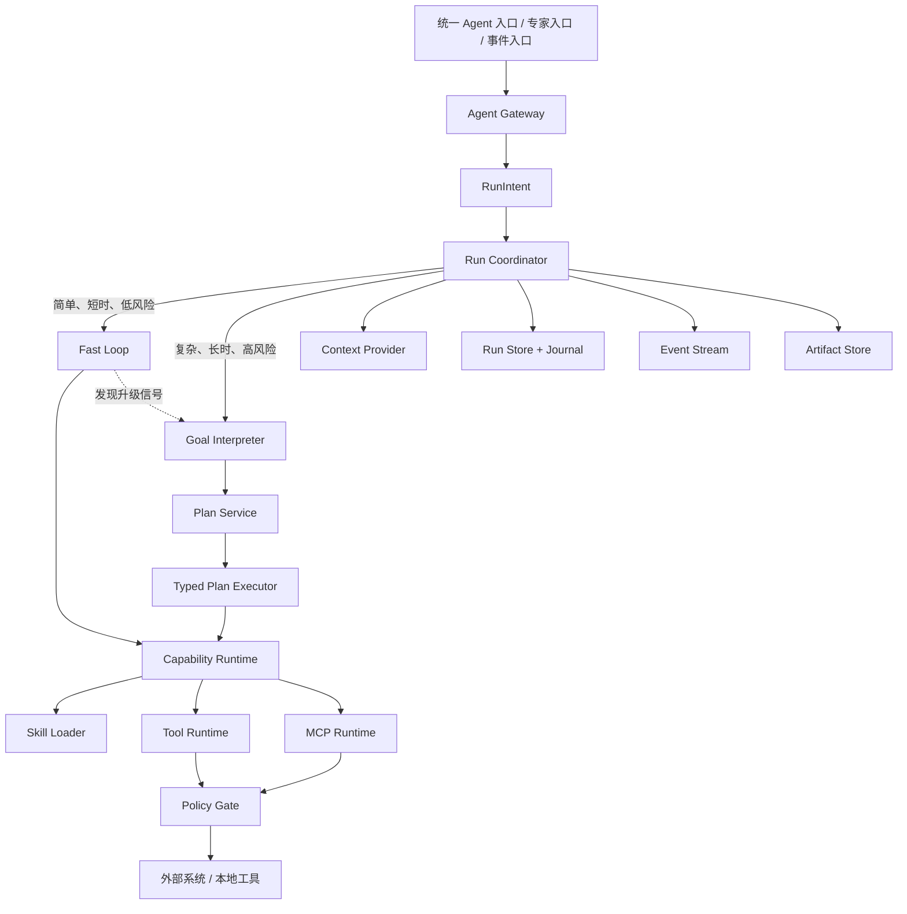

# Manufacturing Agent Runtime 重构设计

日期：2026-07-16

状态：已完成设计评审，等待文档复核

目标版本：B1

## 1. 摘要

本设计将 Maestro 从“内置计划、调度、查询等固定业务引擎的平台”重构为“面向制造业的受控智能执行 Agent”。核心借鉴 Claude Code 的统一 Agent Loop、渐进式 Skill 加载、工具权限与上下文管理思想，但不照搬其面向开发者终端的产品形态。

B1 的核心是一个统一 Agent Runtime：所有入口、Skill、Tool 和 MCP 调用共享同一套运行状态、安全策略、审计日志、预算、取消、恢复与事件协议。Runtime 本身不内置排产、齐套、催料、派工等制造业务能力；这些能力后续全部以 Skill 及其依赖的 Tool/MCP 形式扩展。

运行时采用 H2“风险自适应双路径”：

- 简单问答、单 Skill、短时只读任务进入 Claude Code 式动态循环，不强制生成完整计划。
- 多 Skill、跨系统、长时间、后台执行或高风险任务进入 `GoalSpec + Typed Plan` 结构化路径。
- 快速路径在发现风险或复杂度升级信号后，只能单向升级到结构化路径。
- 两条路径共享安全和运行底座，不能通过选择路径绕过权限、审批、预算或审计。

## 2. 已确认的产品决策

### 2.1 产品定位

产品定位为制造业智能执行 Agent，而不是通用 Agent 开发平台。它提供通用执行底座，但产品体验、风险模型和后续 Skill 生态面向制造场景。

### 2.2 自治边界

采用受控执行模式：

- 低风险、可逆、只读或明确授权的动作可自动执行。
- 重要写操作、不可逆动作、外部影响动作和高风险动作必须经过风险自适应审批。
- 事件可以唤醒 Agent，但事件触发不扩大权限。
- 运行时必须支持暂停、取消、恢复、对账和审计。

### 2.3 产品入口

前端默认提供统一 Agent 入口，同时保留面向专业用户的专家入口。两类入口只改变交互视图或初始上下文，不创建不同的执行内核，也不能形成不同的权限路径。

### 2.4 迁移策略

B1 采用直接替换，不保留以下兼容层：

- 旧 Planning/Scheduling/Query 三引擎路由语义；
- 旧 API、SSE 事件和会话数据格式；
- 旧 PlanningStrategy、StrategyRegistry、CP-SAT 和策略插件；
- 现有齐套、催料、派工等内置业务能力。

这是一项有意的范围决策。未来排产及其他制造能力由独立 Skill 带入，不在 Runtime Core 中预埋兼容抽象。

## 3. 设计原则

1. **一个运行内核**：所有请求最终由同一个 Run Coordinator 管理。
2. **风险优先于模型判断**：模型可以提出动作，不能降低确定性策略给出的风险等级。
3. **Skill 是说明和编排，不是安全边界**：实际副作用必须通过 Tool/MCP 并经过 Policy Gate。
4. **渐进式上下文**：先发现元数据，再加载 `SKILL.md`，辅助资源按需读取。
5. **执行可恢复**：重要状态来自 Journal，可重放并重建 Run。
6. **副作用可证明**：写入必须具备幂等、审批、执行证据或对账路径。
7. **核心无业务能力**：Runtime Core 只包含通用机制。
8. **边界清晰**：组件通过明确协议通信，不通过隐式共享状态互相调用。

## 4. 总体架构

### 4.1 单一状态机所有者

`Run Coordinator` 是 Run 状态迁移的唯一所有者。LLM、Skill、Tool、MCP 和子 Run 只能返回提议或结果，不能直接修改顶层运行状态。

这一约束避免以下问题：

- Skill 绕过主循环直接调用另一个 Skill；
- Tool 在 Runtime 不知情的情况下触发后续动作；
- 多个组件分别维护审批或重试状态；
- 崩溃后无法判断哪个状态是事实来源。

## 5. 核心组件

### 5.1 Agent Gateway

职责：

- 接收聊天、专家入口、后台事件和恢复请求；
- 规范化身份、会话、输入附件、来源和初始权限上下文；
- 创建或恢复 Run；
- 将统一事件流映射给 API/SSE/CLI 等传输层。

Gateway 不负责业务路由，也不直接选择制造能力。

### 5.2 RunIntent

每个新请求都先生成轻量 `RunIntent`，至少包含：

- 用户目标的简要表述；
- 请求来源和执行主体；
- 初步读写属性；
- 已知 Skill/Tool/MCP 候选；
- 复杂度和风险信号；
- 时间、步骤和资源预算；
- 是否允许后台继续执行。

`RunIntent` 不是详细计划，也不保存模型的隐式推理过程。它是运行时用于选择初始路径和建立安全边界的结构化输入。

### 5.3 Goal Interpreter

仅在结构化路径中启用。它把用户目标解释为 `GoalSpec`：

- objective：要达成的结果；
- constraints：硬约束和用户限制；
- success_criteria：可验证的完成条件；
- required_outputs：最终必须交付的内容；
- known_inputs：已确认输入及其来源；
- unknowns：执行前或执行中需要解决的问题；
- risk_context：已识别的风险和审批要求。

`GoalSpec` 是应用层的结构化目标契约，不等同于模型的 chain-of-thought，也不是 Claude、OpenAI 或 Gemini 的原生概念。

### 5.4 Plan Service

仅在结构化路径中启用。它生成并校验 `Typed Plan`。每个步骤至少包含：

- step_id 和明确类型；
- 输入引用和输出契约；
- 依赖关系；
- Skill/Tool/MCP 候选；
- 读写与风险属性；
- 超时、重试和预算；
- 审批检查点；
- 验证器或成功条件；
- 失败、补偿或对账策略。

Typed Plan 是可验证、可执行、可恢复的应用层计划，不是模型自然语言推理记录。Plan Service 可以请求模型提出计划，但最终结构必须由 Runtime 校验。

### 5.5 Run Coordinator

职责：

- 管理 Run 和 Step 状态机；
- 选择并驱动快速路径或结构化路径；
- 处理单向升级；
- 执行预算、循环和步数限制；
- 协调审批、取消、重试、对账和恢复；
- 生成 Journal 事件和用户可见事件；
- 固定本次运行使用的 Skill/Tool/MCP 版本或内容摘要。

### 5.6 Capability Runtime

提供统一能力调用协议，包含 Skill、Tool 和 MCP 三类能力。它负责发现、解析、调用、结果规范化和能力版本固定，不负责最终授权。

能力之间不能直接互相调用。任何嵌套调用必须返回 Coordinator，由 Coordinator 创建步骤或 Child Run。

### 5.7 Policy Gate

Policy Gate 是所有真实 Tool/MCP 调用前的强制检查点。判定输入包括：

- 主体身份和组织策略；
- Tool/MCP 的确定性风险元数据；
- 当前动作参数、目标资源和影响范围；
- RunIntent、GoalSpec 和 Typed Plan 中的约束；
- 用户在本次 Run 中给予的授权；
- 外部状态是否与批准时一致；
- 幂等键和历史执行证据。

策略结果至少包括：允许、拒绝、需要确认、需要重新确认。Skill 中的 `allowed-tools` 只能进一步缩小工具范围，不能覆盖全局 deny 或提升权限。

### 5.8 Run Store、Journal 与 Artifact Store

`Run Store` 保存当前可查询状态；`Journal` 追加记录事实事件，是恢复和审计的事实来源；`Artifact Store` 保存不适合放入模型上下文的大结果、文件和可复现中间产物。

B1 只实现当前 Run 的持久化、恢复和必要上下文，不实现跨日期的长期用户记忆。

### 5.9 Context Provider

Context Provider 在每次 LLM 节点调用前重新组装上下文，不让上下文成为无限增长的字符串。优先级为：

- P0：目标、用户明确决定、待审批项、当前错误；
- P1：当前工作集、当前 Skill、当前步骤及必要输入；
- P2：已完成步骤和 Tool/MCP 结果摘要；
- P3：可通过引用重新获取的内容。

大结果进入 Artifact Store，上下文只携带摘要、内容摘要值和引用。

### 5.10 Event Stream

所有入口共享统一的 Run/Step/Approval 事件协议。事件至少覆盖：

- Run 创建、路径选择、路径升级、暂停、恢复、取消和完成；
- Step 准备、开始、结果、失败、重试、对账和跳过；
- Approval 请求、批准、拒绝、过期和重新请求；
- Skill 加载、Tool/MCP 调用与 Policy 判定；
- Artifact 创建与最终结果生成。

事件是产品展示和审计投影，不替代 Journal 的事实记录。

## 6. H2 风险自适应双路径

### 6.1 快速路径

适用条件：

- 简单问答；
- 单个 Skill；
- 单次或少量只读 Tool/MCP 调用；
- 可在较短步数和时间预算内完成；
- 不包含后台等待、复杂依赖或高风险动作。

快速路径采用动态 Agent Loop：模型基于当前上下文提出下一步 Tool/Skill 调用或最终答案，Runtime 在每一步执行 schema、预算、循环和权限校验。

快速路径不生成完整 `GoalSpec + Typed Plan`，但必须具备 `RunIntent`、Journal、Policy Gate、预算、取消和恢复能力。

### 6.2 结构化路径

触发条件包括：

- 多 Skill 或明显多阶段任务；
- 跨系统写操作；
- 长时间运行、后台执行或外部等待；
- fork/Child Run 协作；
- 显式高风险或影响范围较大的动作；
- 需要可验证依赖、审批点或补偿路径。

结构化路径必须先建立 `GoalSpec`，再生成并校验 `Typed Plan`，之后按依赖关系执行。

### 6.3 单向升级

快速路径出现以下信号时，Coordinator 必须停止继续自由执行并升级：

- 即将发生高风险写入；
- 发现任务需要多个相互依赖步骤；
- 需要长时间等待或后台恢复；
- 需要 fork/Child Run；
- 原预算或成功条件已经不足以安全完成。

升级过程必须：

1. 冻结当前快速路径工作集；
2. 写入升级原因和证据；
3. 保持同一 Run 身份、Journal、预算、幂等键和审批历史；
4. 从已知事实构建 GoalSpec 和 Typed Plan；
5. 重新校验策略后继续。

结构化路径不能降回快速路径。模型不能通过重新描述任务降低 Tool/MCP 的确定性风险等级。

## 7. Skill 兼容模型

### 7.1 兼容目标

B1 采用严格 Claude Code Skill 目录契约：Skill 目录以 `SKILL.md` 为入口，支持 Claude Code 已使用的核心 frontmatter 和调用语义，包括：

- `name`、`description`、`when_to_use`、`version`；
- `allowed-tools`；
- 参数和 argument hint；
- `user-invocable`、`disable-model-invocation`；
- `context: fork`；
- agent、model、effort；
- hooks、shell 相关声明。

Runtime Core 不在 Skill frontmatter 中新增 Maestro 专属的 `risk-level`、`result-schema`、`preconditions`、`idempotency` 或 `success-criteria` 字段。此类执行和安全语义属于 Tool/MCP、Policy、GoalSpec 或 Typed Plan。

### 7.2 渐进披露

Skill 资源按以下层级加载：

1. **发现阶段**：只加载 name、description 等用于匹配的元数据，并受元数据上下文预算约束；
2. **调用阶段**：匹配后加载完整 `SKILL.md`；
3. **执行阶段**：根据 `SKILL.md` 的明确指引按需读取 `references/`、执行 `scripts/` 或传递 `assets/`。

`scripts/`、`references/` 和 `assets/` 不会因为 Skill 被匹配而全部自动加载。脚本通常把执行输出贡献给上下文，而不是把脚本源码整体注入上下文。

### 7.3 Inline 与 Fork

- 默认 inline：Skill 正文作为受信任指令进入当前 Run 的工作上下文，继续由同一 Runtime 驱动。
- `context: fork`：创建隔离上下文和独立预算的 Child Run，结果通过结构化引用返回父 Run。

Child Run 不能扩大父 Run 权限，不能绕过父 Run 的 Policy Gate，并必须保留父子关联和审计链路。

### 7.4 信任边界

- 系统策略、经过解析的 Skill 指令和用户明确决定属于受信任指令层；
- Tool/MCP 输出、检索内容、Skill references 和外部文件一律视为不可信数据；
- 不可信内容不能覆盖系统策略、授权状态或工具风险元数据；
- 远程 MCP Skill 不能借 Skill 内容执行未经授权的本地 Shell。

## 8. 数据流

### 8.1 新 Run

1. Gateway 规范化请求并创建 Run。
2. Runtime 生成 RunIntent，固定主体、预算和能力版本视图。
3. Coordinator 根据确定性规则和模型辅助选择初始路径。
4. 快速路径直接进入有界动态循环；结构化路径先生成 GoalSpec 和 Typed Plan。
5. Capability Runtime 加载 Skill 或准备 Tool/MCP 调用。
6. 所有真实调用先经过 Policy Gate。
7. 结果写入 Journal；大结果写入 Artifact Store。
8. Coordinator 验证成功条件并生成最终结果。

### 8.2 审批

1. Policy Gate 返回 `requires_confirmation`。
2. Coordinator 暂停对应步骤并生成 Approval Request，包括动作、参数摘要、影响、风险、有效条件和过期策略。
3. 用户批准或拒绝。
4. 执行前重新读取必要外部状态并校验批准条件。
5. 状态变化导致批准失效时，旧批准不可复用，必须生成新的影响说明和 Approval Request。

### 8.3 恢复

1. 进程重启后读取 Run Store 和 Journal。
2. 重放事件重建路径、步骤、预算、审批和幂等状态。
3. 对 `started` 但无确定结果的写步骤进入 reconciliation。
4. 只有确认未发生副作用且满足重试条件时才允许重试。
5. 恢复过程继续发布统一事件，不伪造已完成状态。

## 9. 状态模型

建议 Run 状态：

- `created`
- `running_fast`
- `structuring`
- `running_structured`
- `waiting_approval`
- `waiting_external`
- `reconciling`
- `cancelling`
- `cancelled`
- `failed`
- `completed`

建议 Step 状态：

- `pending`
- `ready`
- `waiting_approval`
- `running`
- `waiting_external`
- `reconciling`
- `succeeded`
- `failed`
- `cancelled`
- `skipped`

所有状态迁移必须由 Coordinator 执行并写入 Journal。状态机应拒绝非法回退，例如从结构化路径回到快速路径，或从已完成步骤重新进入运行状态。

## 10. 错误、重试与补偿

错误统一分类为：

- schema/input：参数或结果不符合契约；
- business_blocked：业务前置条件不满足；
- authorization：权限拒绝或批准缺失；
- transient_infrastructure：可识别的临时基础设施错误；
- unknown_or_bug：未知结果、实现缺陷或无法安全判断。

自动重试必须同时满足：

- 错误被明确标记为 retryable；
- 动作具备幂等性或确认尚未产生副作用；
- 未超过步骤和 Run 预算；
- Policy Gate 仍允许执行。

写动作结果未知时不得直接重试，必须先进入 reconciliation。补偿不是普通异常处理，而是独立、受治理、可审批的能力调用。

取消采用协作式取消。若取消时存在无法确认的写入结果，Run 进入 `reconciling` 状态并设置 `requires_reconciliation=true`；在完成对账前不得迁移到 `cancelled`，也不得宣称安全结束。

## 11. 安全模型

### 11.1 风险来源优先级

风险判定以确定性元数据和真实动作结构为主，优先级高于模型或 Skill 描述：

1. 组织级 deny 和强制审批策略；
2. Tool/MCP 注册的风险、读写、幂等和影响范围元数据；
3. 目标资源与调用参数；
4. RunIntent、GoalSpec、Typed Plan 和用户授权；
5. 模型或 Skill 提供的辅助分类。

低优先级来源只能提高谨慎程度，不能降低高优先级来源给出的限制。

### 11.2 版本固定

Run 启动后固定所用 Skill、Tool、MCP Provider 的版本或内容摘要。运行中发现版本变化时，不静默切换；应暂停并重新规划或要求确认，防止语义漂移。

### 11.3 副作用证据

每个写步骤至少记录：

- 规范化调用参数摘要；
- Policy 判定和相关批准；
- 幂等键；
- 调用开始和结束证据；
- 外部结果或对账引用；
- 版本信息和时间戳。

## 12. 测试策略

### 12.1 单元测试

覆盖：

- RunIntent 路径分类；
- 风险来源优先级；
- Run/Step 状态迁移；
- 快速路径到结构化路径的单向升级；
- schema、预算、循环和步数限制；
- 上下文优先级与裁剪；
- 重试、幂等和取消规则。

### 12.2 契约与重放测试

覆盖：

- Claude Code Skill 发现优先级；
- user/model 调用控制；
- 参数替换和 Skill 目录引用；
- inline/fork 行为；
- `allowed-tools` 与全局 deny 优先级；
- hooks、shell 和远程 MCP Skill 限制；
- metadata → `SKILL.md` → 辅助资源的渐进加载；
- Tool/MCP 结果协议；
- Journal 从任意中断点重放得到一致状态。

### 12.3 集成测试

必须包含：

1. 简单只读请求停留在快速路径，不生成完整 Typed Plan；
2. 复杂任务初始进入结构化路径；
3. 快速路径发现高风险写动作后安全升级，升级前无副作用；
4. 升级后 Run 身份、上下文、预算、幂等键和 Journal 连续；
5. 结构化路径不能降回快速路径；
6. 过期批准触发重新校验和重新批准；
7. Child Run 权限不扩大，结果正确关联父 Run；
8. 写动作超时后先对账，不发生盲目重复执行；
9. 崩溃恢复后路径和待审批状态一致。

### 12.4 安全对抗测试

覆盖：

- Tool/MCP 输出诱导覆盖系统指令；
- Skill references 中的提示注入；
- `allowed-tools` 试图覆盖全局 deny；
- 远程 MCP Skill 试图执行本地 Shell；
- 并发或重试导致重复副作用；
- 运行中替换 Skill/Provider 造成语义漂移；
- 模型试图把高风险动作描述为低风险；
- 快速路径被利用来绕过结构化审批点。

### 12.5 端到端测试

覆盖默认 Agent 入口、专家入口、审批交互、事件流、取消、恢复和最终结果。两类入口必须产生兼容的 Run、Policy 和 Journal 行为。

## 13. B1 完成定义

B1 只有在以下条件全部满足时才算完成：

- RunIntent 能确定性选择快速或结构化初始路径；
- 快速路径可安全单向升级，且上下文和运行身份连续；
- 两条路径共用 Policy、Journal、预算、取消和事件协议；
- GoalSpec 和 Typed Plan 只在必要时生成，并能被 schema 校验和重放；
- Claude 格式 Skill 支持 inline/fork 及三级渐进加载；
- Skill、Tool 和 MCP 不能绕过 Policy Gate；
- 高风险动作触发风险自适应审批和执行前重校验；
- 崩溃后 Run 可恢复，未知写入结果可对账且不会盲目重复执行；
- 默认 Agent 与专家入口共享统一 Runtime；
- Runtime Core 不包含排产、齐套、催料、派工等制造业务能力；
- 测试能够重复证明上述行为，而不是依赖人工观察模型输出。

## 14. B1 非目标

以下内容明确不属于 B1：

- 任何真实制造 Skill；
- 排产算法、CP-SAT、PlanningStrategy 或策略插件；
- 齐套、催料、派工等业务实现；
- B2 长会话记忆、跨日期事实和语义检索；
- 开放式多 Agent 或 Swarm；
- 旧 API、旧 SSE 协议和旧会话数据兼容；
- 面向第三方开发者的完整 Agent 平台或 Marketplace 产品。

## 15. B2 以后再考虑的能力

- SessionFacts、RollingSummary 和跨会话检索；
- 长期用户偏好和组织知识；
- 真实制造 Skill 包；
- 排产 Skill 及其算法、求解器和数据适配器；
- Skill 分发、签名、信任等级和企业治理；
- 多 Run 协作和更复杂的后台任务编排。

这些能力必须建立在 B1 的统一 Runtime 和安全边界上，不应反向污染 Runtime Core。

## 16. 与当前代码的关系

当前 Maestro 的三引擎、Scheduling ReAct Loop、SkillEngine、ActionGate、事件和会话实现只能作为迁移时的能力来源，不是目标架构边界。实施阶段应先建立新的通用 Runtime 骨架，再按目标契约迁移可复用的基础设施。

实施计划需要明确删除、替换和迁移顺序，但不得为了降低迁移难度恢复本设计已经排除的兼容层或内置业务能力。

## 17. 关键不变量

1. 每个请求都有 RunIntent。
2. 只有 Coordinator 能迁移 Run/Step 状态。
3. 所有真实副作用都经过 Policy Gate。
4. 模型和 Skill 不能降低确定性风险等级。
5. 快速路径只能升级，不能从结构化路径降级。
6. Child Run 权限不超过父 Run。
7. 未知写入结果先对账，后决定是否重试。
8. Journal 能重建重要运行状态。
9. 辅助 Skill 资源按需加载，不整体注入上下文。
10. Runtime Core 不包含制造业务能力。

这些不变量是后续实施计划、代码评审和验收测试的共同判断标准。
